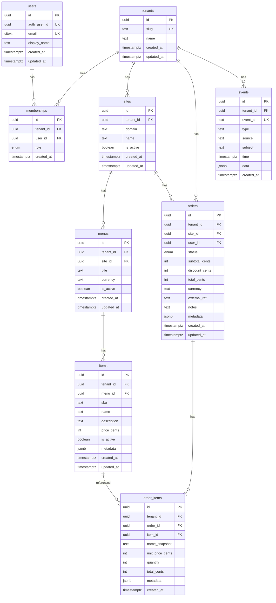

# Potlucky ERD (Baseline)

## Сущности

### Core Entities

- **tenants** — организация/клиент (multi-tenant архитектура)
- **users** — глобальные пользователи (привязка к auth.users по `auth_user_id`)
- **memberships** — роли пользователей в рамках тенанта (many-to-many)

### Business Entities

- **sites** — витрины/сайты внутри тенанта
- **menus** — меню, принадлежит сайту
- **items** — позиции меню с ценами
- **orders** — заказы по сайту
- **order_items** — строки заказа (денормализованные)

### System Entities

- **events** — outbox/аудит (CloudEvents-подобная запись)

## Ключевые особенности

### Multi-tenancy

- Все таблицы (кроме `memberships`) содержат `tenant_id`
- RLS политики будут настроены в S-01.3 (deny-by-default)

### Денормализация

- `order_items.name_snapshot` — фиксирует состояние на момент заказа
- `order_items.total_cents` — вычисляемое поле (unit_price \* quantity)

### Денежные значения

- Все цены в центах (integer)
- Check constraints: `>= 0`
- Currency: USD по умолчанию

### Временные метки

- `created_at`, `updated_at` — timestamptz
- `updated_at` — автоматически обновляется триггером

## Диаграмма (Mermaid)

## Индексы

### Основные индексы

- `tenant_id` — на всех таблицах для RLS
- `status` — на orders для фильтрации
- `created_at` — на orders для сортировки
- `is_active` — на items для фильтрации

### Составные индексы

- `events(tenant_id, time desc)` — для аудита по тенанту
- `events(type, time desc)` — для событий по типу

### Уникальные ограничения

- `tenants(slug)` — для поддоменов
- `users(email)` — глобально уникальный email
- `memberships(tenant_id, user_id)` — одна роль на пользователя в тенанте
- `sites(tenant_id, name)` — уникальное имя сайта в тенанте
- `menus(site_id, title)` — уникальное название меню на сайте
- `items(menu_id, name)` — уникальное название позиции в меню

## Связи и каскады

### CASCADE удаления

- `tenants` → `memberships`, `sites`, `menus`, `items`, `orders`, `order_items`
- `users` → `memberships`
- `sites` → `menus`
- `menus` → `items`
- `orders` → `order_items`

### RESTRICT удаления

- `sites` → `orders` (нельзя удалить сайт с заказами)
- `items` → `order_items` (нельзя удалить позицию с заказами)

### SET NULL

- `users` → `orders` (пользователь может быть удален)
- `tenants` → `events` (события сохраняются для аудита)
